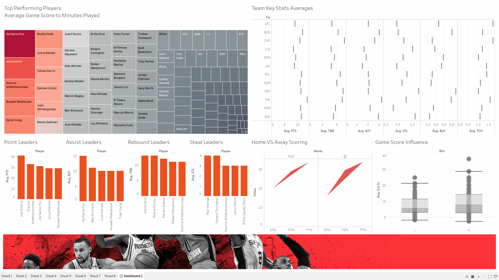

# Observing NBA Game Score as a Stat Line
Observing Game Score of daily leaders and what it shows us about a player's/team's match performance.

## What is Game Score?
1. This statistic was invented by John Hollinger to provide a rough measure of a player's performance in a given game.  The scale upon which the player's game score is based is the same as points scored.  If a player has a game score of 40, that is amazing, while a game score of 10 is average.
2. The formula for calculating game score is as follows: (Points x 1.0) + (FGM x 0.4) + (FGA x -0.7) + ((FTA-FTM) x -0.4) + (OREB x 0.7) + (DREB x 0.3) + (STL x 1.0) + (AST x 0.7) + (BLK x 0.7) + (PF x -0.4) + (TO x -1.0). 

As can be plainly seen, this statistic takes into account almost everything a player does during a game that can be quantified.  These statistics are then weighted and added together to get a game score.  This method is similar to Dr. Dean Oliver's Four Factors, but attempts to add value by considering all the stats, rather than just the four most important ones.

## The Data 
We take a look at the NBA Daily Stat Leaders according to [https://www.basketball-reference.com](https://www.basketball-reference.com/friv/dailyleaders.fcgi?month=11&day=1&year=2018) from 01/11/2018 to 27/11/2018.

## Building the code to get the data 
```
import urllib3
import csv
urllib3.disable_warnings(urllib3.exceptions.InsecureRequestWarning)
from bs4 import BeautifulSoup
import datetime
```
These are the modules we imported into our Python codes:    
**urllib3** is a powerful HTTP client for Python.  
**csv** allows us to import or export spreadsheets and databases for use in the Python interpreter.  
**BeautifulSoup** is a Python library for pulling data out of HTML and XML files.  
**datetime** provides a number of function to deal with dates, times and time intervals.

```
http = urllib3.PoolManager()
url = "https://www.basketball-reference.com/friv/dailyleaders.fcgi?month=11&day="+str(day)+"&year=2018"
response = http.request('GET', url)
```
class **urllib3.poolmanager.PoolManager** allows for arbitrary requests while transparently keeping track of necessary connection pools for you.  


## Data Visualisation 


Using Tableau, we desgined a dashboard which the GIF above illustrates. It shows the progression of the acquired data sets from 01/11/2018 to 27/11/2018. We shall explore each sheet of the dashbaord further below.   


The heat map above depicts the average game score of an individual player across the 27 days in descending order. It is not surprising to have players like Nikola Jokic and Karl-Anthony Towns, both who are amongst the league's elite and key players for their respective teams, leading the way. However, it is interesting to see players such as Joe Ingles and T.J. Warren, both solid role players for their sqaud, ahead of the likes of MVP calibre players such as James Harden and Lebron James. This highlights the importance of role players and how their contribution may be overlooked easily without first weighing the influence of each statistic.  


The figure above is an attempt to illustrate the difference in a player's performance at and away from home. It plots the average field goal, 3 point and free throw percentage separately for home (Null) and away (@) matches. Albeit small, a difference in shooting percentages at home and away can be observed. 


The figure above shows the average stats per player per team across the observed dates. 


The box plot shown above shows the influence of average game score on wins and losses of a team. We could say from the box plot that a low average game score has a larger impact on a team's loss than a high average game score has on a team's win. 


The bar graph above shows the top 5 players in average points per game from 01/11/2018 to 27/11/2018.


The bar graph above shows the top 5 players in average assists per game from 01/11/2018 to 27/11/2018.


The bar graph above shows the top 5 players in average rebounds per game from 01/11/2018 to 27/11/2018.


The bar graph above shows the top 5 players in average steals per game from 01/11/2018 to 27/11/2018.


